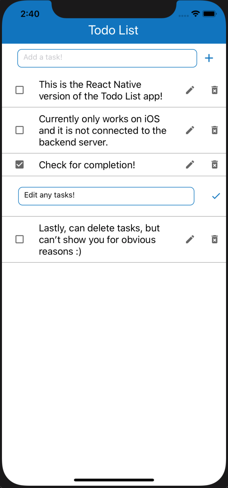

# Todo List App
A simple Todo List web application made using GraphQL and MERN stack. Features include adding, editing, and removing tasks. It is currently a global list where all users contribute to the same list.    
In the mobile branch of this repo, there is an iOS version of the Todo List App, which is currently not connected to the backend server. It uses React Native rather than React! 
## Incoming Features
User Authenthication  
Personalized Todo Lists  
Real-time Collaborative Editing
## Check it out!
It is hosted at https://todo-list-jle.herokuapp.com/
## Mobile Version  

